# 淘宝电商用户行为分析与购买预测

本项目基于淘宝 `UserBehavior` 用户行为数据，完成从数据清洗、关系型数据库建模、SQL 指标分析到购买预测建模的完整分析链路。项目围绕浏览（PV）、收藏（Fav）、加购（Cart）和购买（Buy）行为，帮助业务理解用户如何从“产生兴趣”逐步走向“完成购买”。

## 目录

- [1. 项目背景](#1-项目背景)
- [2. 数据来源](#2-数据来源)
- [3. 技术栈](#3-技术栈)
- [4. 分析问题](#4-分析问题)
- [5. 数据清洗](#5-数据清洗)
- [5. SQL 分析](#5-sql-分析)
- [6. 机器学习建模](#6-机器学习建模)
- [7. 结论与业务建议](#7-结论与业务建议)
- [8. 项目结构与运行方式](#8-项目结构与运行方式)

## 1. 项目背景

电商平台每天会产生大量浏览、收藏、加购和购买记录。单纯查看销售额或订单量，只能看到已经发生的结果，无法解释用户为什么购买、为什么流失，以及哪些商品具有潜在增长机会。

用户行为分析可以帮助平台回答以下业务问题：

- 用户从浏览到购买经历了怎样的行为路径？
- 浏览、收藏、加购分别有多大概率转化为购买？
- 用户通常在哪些日期和时段更加活跃？
- 哪些商品和类目获得了较高关注，但购买转化仍然偏低？
- 哪些用户已经形成复购习惯，哪些用户需要召回？
- 能否利用用户近期行为预测其下一阶段可能购买的商品？

因此，本项目将描述性分析、诊断性分析和预测性分析结合起来，为流量运营、商品运营、用户运营和精准营销提供数据依据。

## 2. 数据来源

数据来自阿里云天池公开的[淘宝用户购物行为数据集](https://tianchi.aliyun.com/dataset/649)。原始 `UserBehavior.csv` 记录了匿名用户在淘宝商品上的行为，核心观察期为 **2017-11-25 至 2017-12-03**。

原始文件不包含表头，每一行表示一次用户行为：

| 字段 | 类型 | 说明 |
|---|---|---|
| `user_id` | BIGINT | 匿名用户 ID |
| `item_id` | BIGINT | 匿名商品 ID |
| `category_id` | BIGINT | 商品类目 ID |
| `behavior_type` | VARCHAR | 用户行为类型 |
| `timestamp` | BIGINT | Unix 时间戳，单位为秒 |

行为类型定义如下：

| 行为值 | 中文含义 | 业务解释 |
|---|---|---|
| `pv` | 浏览 | 用户查看商品详情页 |
| `fav` | 收藏 | 用户收藏商品 |
| `cart` | 加购 | 用户将商品加入购物车 |
| `buy` | 购买 | 用户完成购买 |

读取原始数据时为无表头 CSV 指定字段：

```python
import pandas as pd

data_path = r"data/row/UserBehavior.csv"
cols = [
    "user_id",
    "item_id",
    "category_id",
    "behavior_type",
    "timestamp",
]

df = pd.read_csv(
    data_path,
    names=cols,
    header=None,
    nrows=1_000_000,  # 本地开发时可先读取部分数据
)
```

> 数据规模说明：官方数据集规模较大。本项目的数据清洗脚本支持通过 `nrows` 生成开发样本；当前 SQL 结果基于项目清洗文件，分析结果代表当前项目数据子集，不应直接外推为淘宝平台整体表现。

## 3. 技术栈

| 环节 | 技术 | 用途 |
|---|---|---|
| 数据处理 | Python、pandas | CSV 读取、清洗、时间处理、特征构造 |
| 数据存储 | PostgreSQL | 保存行为明细并执行聚合分析 |
| SQL 兼容 | MySQL | 可通过 `SUM(CASE WHEN ...)` 改写 PostgreSQL 的 `FILTER` |
| 机器学习 | scikit-learn | 数据切分、随机森林、交叉验证与模型评估 |
| 版本管理 | Git | 管理分析代码、SQL 和建模脚本 |

项目采用以下数据链路：

```text
UserBehavior.csv
        ↓
pandas 数据清洗
        ↓
清洗后的 CSV / PostgreSQL
        ↓
SQL 指标分析与结果可视化
        ↓
用户—商品特征工程
        ↓
随机森林购买预测
```

## 4. 数据清洗

数据清洗代码位于 [`data_cleaning.py`](data_cleaning.py)，主要处理重复记录、缺失值、异常时间戳、时间维度拆分和非法行为类型。

### 4.1 删除重复记录

重复行为会放大 PV、转化率和用户活跃度，因此先进行整行去重：

```python
df = df.drop_duplicates()
```

### 4.2 检查缺失值

```python
missing = df.isna().sum()
print(missing)
```

对于关键字段，推荐执行：

```python
required_cols = [
    "user_id",
    "item_id",
    "category_id",
    "behavior_type",
    "timestamp",
]

df = df.dropna(subset=required_cols)
```

不直接用均值或众数填补用户、商品和时间字段，因为这会人为制造不存在的行为。

### 4.3 时间戳转换

先将非法时间戳转成缺失值，再删除并转换为整数：

```python
df["timestamp"] = pd.to_numeric(
    df["timestamp"],
    errors="coerce",
)
df = df.dropna(subset=["timestamp"])
df["timestamp"] = df["timestamp"].astype("int64")
```

将 Unix 时间戳拆分为可分析的时间维度：

```python
df["datetime"] = pd.to_datetime(
    df["timestamp"],
    unit="s",
)
df["date"] = df["datetime"].dt.date
df["hour"] = df["datetime"].dt.hour
df["weekday"] = df["datetime"].dt.day_name()
```

### 4.4 行为类型过滤

```python
valid_behaviors = ["pv", "fav", "cart", "buy"]
df = df[df["behavior_type"].isin(valid_behaviors)]
```

### 4.5 限定分析时间窗口

原始数据可能混入极少量异常日期。正式分析时统一限制到目标观察期：

```python
analysis_start = pd.Timestamp("2017-11-25")
analysis_end = pd.Timestamp("2017-12-04")

df = df[
    (df["datetime"] >= analysis_start)
    & (df["datetime"] < analysis_end)
].copy()
```

使用左闭右开的区间 `[2017-11-25, 2017-12-04)`，可以完整包含 12 月 3 日，同时避免时分秒边界问题。

### 4.6 输出清洗结果

```python
df.to_csv(
    "data/processed/user_behavior_cleaned_sample.csv",
    index=False,
)
```

## 5. SQL 分析

建表脚本位于 [`1_creat_table.sql`](1_creat_table.sql)，核心指标脚本位于 [`2_overview_metrics.sql`](2_overview_metrics.sql)。

### 5.1 建立行为明细表

```sql
CREATE TABLE user_behavior (
    user_id BIGINT,
    item_id BIGINT,
    category_id BIGINT,
    behavior_type VARCHAR(10),
    behavior_timestamp BIGINT,
    behavior_datetime TIMESTAMP,
    behavior_date DATE,
    behavior_hour INT,
    weekday VARCHAR(20)
);
```

PostgreSQL 导入示例：

```sql
COPY user_behavior
FROM 'D:\ecommerce\data\processed\user_behavior_cleaned.csv'
DELIMITER ','
CSV HEADER;
```

### 5.2 核心规模指标
- 整体行为量、用户数、商品数和类目数是多少？

```sql
SELECT
    COUNT(*) AS total_events,
    COUNT(DISTINCT user_id) AS total_users,
    COUNT(DISTINCT item_id) AS total_items,
    COUNT(DISTINCT category_id) AS total_categories,
    MIN(behavior_datetime) AS start_time,
    MAX(behavior_datetime) AS end_time
FROM user_behavior;
```

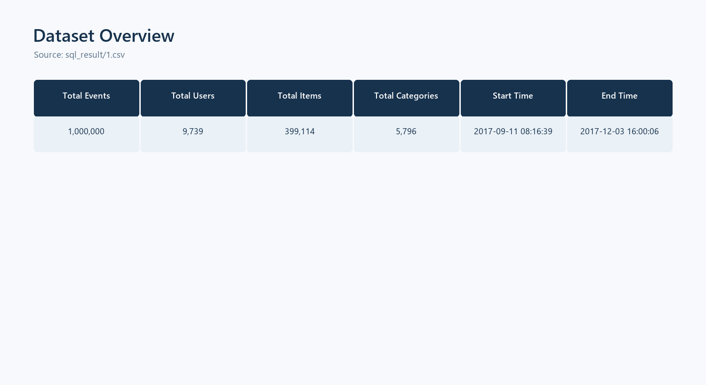

这些指标用于确定数据规模、覆盖范围和时间边界。

行为类型的数量和占比：

```sql
SELECT
    behavior_type,
    COUNT(*) AS event_count,
    ROUND(
        COUNT(*) * 100.0
        / SUM(COUNT(*)) OVER (),
        2
    ) AS event_ratio
FROM user_behavior
GROUP BY behavior_type
ORDER BY event_count DESC;
```

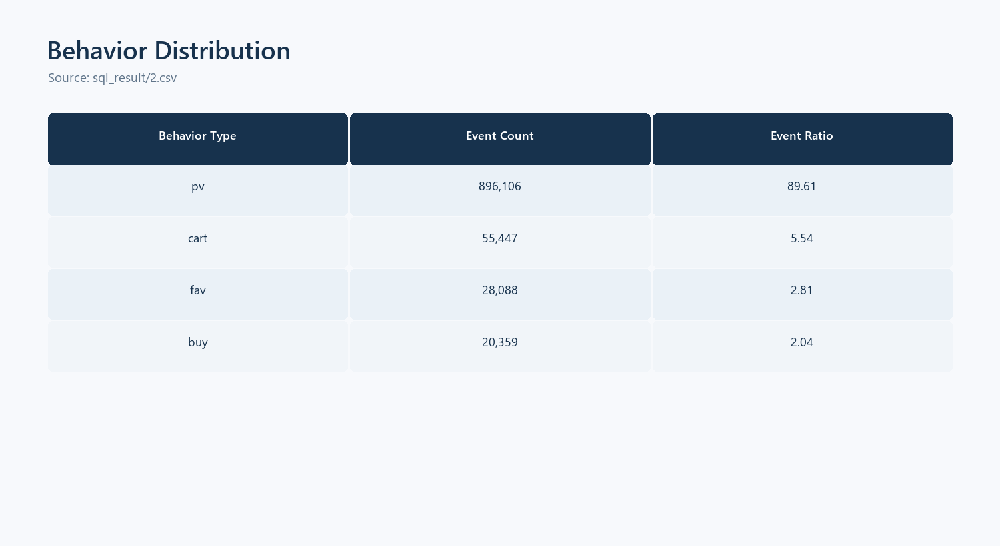

### 5.3 日流量分析
- DAU、PV、UV 和购买用户数如何随日期变化？
- 各商品的日流量？
  
```sql
SELECT
    behavior_date,
    COUNT(*) AS event_count,
    COUNT(*) FILTER (
        WHERE behavior_type = 'pv'
    ) AS pv_events,
    COUNT(DISTINCT user_id) AS uv,
    COUNT(*) FILTER (
        WHERE behavior_type = 'buy'
    ) AS buy_events,
    COUNT(DISTINCT user_id) FILTER (
        WHERE behavior_type = 'buy'
    ) AS paying_users
FROM user_behavior
GROUP BY behavior_date
ORDER BY behavior_date;
```

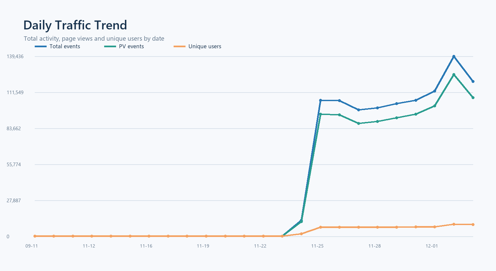

商品级日流量则增加 `item_id` 分组：

```sql
SELECT
    item_id,
    behavior_date,
    COUNT(*) AS event_count,
    COUNT(*) FILTER (
        WHERE behavior_type = 'pv'
    ) AS pv_events,
    COUNT(DISTINCT user_id) AS uv,
    COUNT(*) FILTER (
        WHERE behavior_type = 'fav'
    ) AS fav_events,
    COUNT(*) FILTER (
        WHERE behavior_type = 'cart'
    ) AS cart_events,
    COUNT(*) FILTER (
        WHERE behavior_type = 'buy'
    ) AS buy_events
FROM user_behavior
GROUP BY item_id, behavior_date
ORDER BY item_id, behavior_date;
```

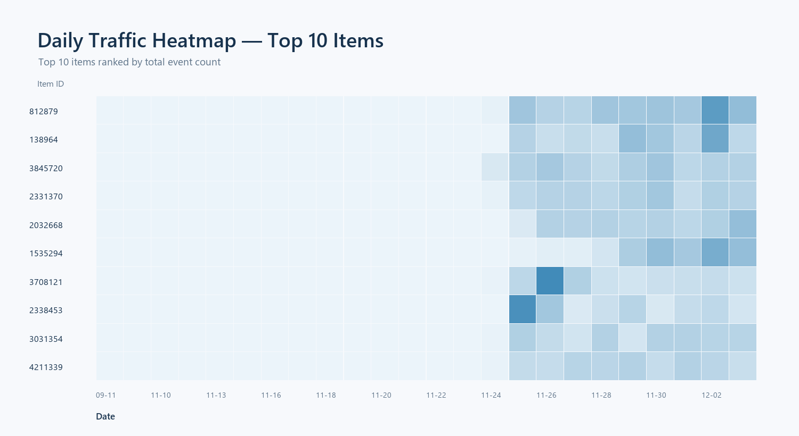

### 5.4 小时流量分析
- 用户在一天中的哪些时段最活跃？
- 商品小时流量？

```sql
SELECT
    behavior_hour,
    COUNT(*) AS event_count,
    COUNT(*) FILTER (
        WHERE behavior_type = 'pv'
    ) AS pv,
    COUNT(DISTINCT user_id) AS active_users,
    COUNT(*) FILTER (
        WHERE behavior_type = 'buy'
    ) AS buy_events
FROM user_behavior
GROUP BY behavior_hour
ORDER BY behavior_hour;
```

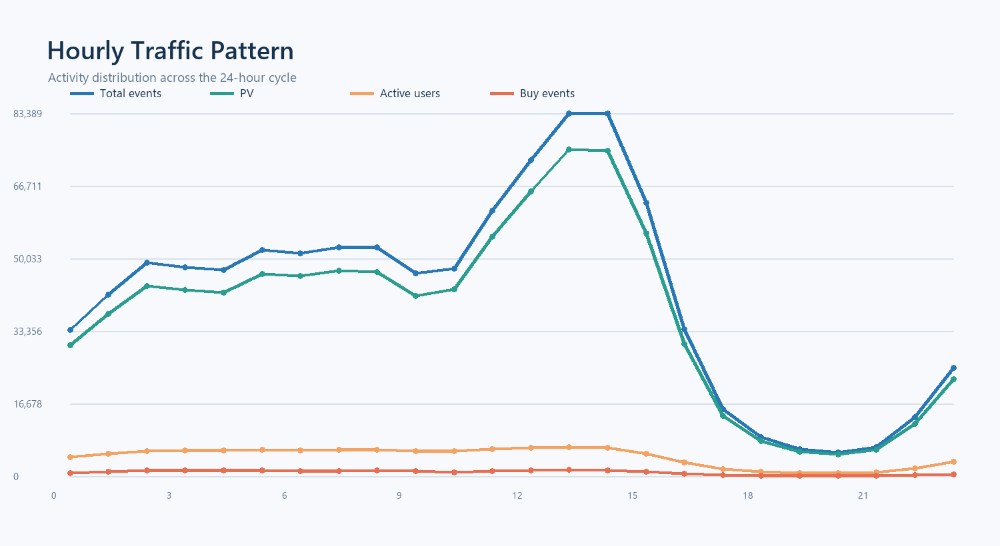

商品小时流量使用：

```sql
SELECT
    item_id,
    behavior_hour,
    COUNT(*) AS event_count,
    COUNT(*) FILTER (
        WHERE behavior_type = 'pv'
    ) AS pv,
    COUNT(DISTINCT user_id) AS uv,
    COUNT(*) FILTER (
        WHERE behavior_type = 'fav'
    ) AS fav_events,
    COUNT(*) FILTER (
        WHERE behavior_type = 'cart'
    ) AS cart_events,
    COUNT(*) FILTER (
        WHERE behavior_type = 'buy'
    ) AS buy_events,
    COUNT(DISTINCT user_id) FILTER (
        WHERE behavior_type = 'buy'
    ) AS paying_users
FROM user_behavior
GROUP BY item_id, behavior_hour
ORDER BY item_id, behavior_hour;
```

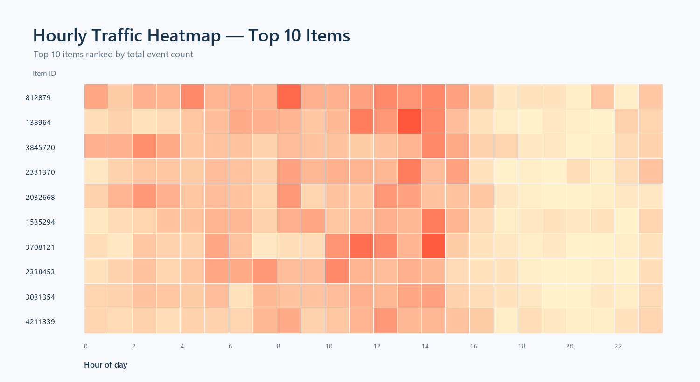

从而识别不同商品的高峰时段。

### 5.5 有效行为到购买转化率
- 浏览、收藏、加购到购买的有效转化率分别是多少？
- 哪种购买前行为代表更强的购买意愿？
  
本项目的有效转化定义为：

```text
同一用户 + 同一商品 + 购买时间晚于来源行为时间
```

事件级转化率定义为：

```text
行为到购买转化率
= 有效转化到购买的行为次数 / 该行为总次数 × 100%
```

```sql
WITH last_buy_by_user_item AS (
    SELECT
        user_id,
        item_id,
        MAX(behavior_datetime) AS last_buy_datetime
    FROM user_behavior
    WHERE behavior_type = 'buy'
    GROUP BY user_id, item_id
),
behavior_to_buy AS (
    SELECT
        source.behavior_type,
        COUNT(*) AS total_behavior_count,
        COUNT(*) FILTER (
            WHERE last_buy.last_buy_datetime
                  > source.behavior_datetime
        ) AS valid_conversion_count
    FROM user_behavior AS source
    LEFT JOIN last_buy_by_user_item AS last_buy
        ON source.user_id = last_buy.user_id
       AND source.item_id = last_buy.item_id
    WHERE source.behavior_type IN (
        'pv',
        'fav',
        'cart'
    )
    GROUP BY source.behavior_type
)
SELECT
    behavior_type,
    total_behavior_count,
    valid_conversion_count,
    ROUND(
        valid_conversion_count * 100.0
        / NULLIF(total_behavior_count, 0),
        2
    ) AS conversion_to_buy_rate
FROM behavior_to_buy
ORDER BY
    CASE behavior_type
        WHEN 'pv' THEN 1
        WHEN 'fav' THEN 2
        WHEN 'cart' THEN 3
    END;
```

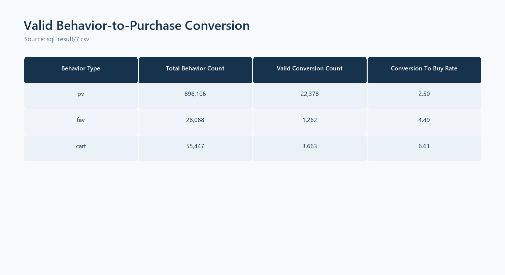

这里使用 `MAX(behavior_datetime)` 可以判断行为之后是否至少存在一次购买，同时避免把一条来源行为与多条购买记录连接后重复计数。

### 5.6 复购分析
- 购买用户中有多少人发生了两次及以上购买？

```sql
WITH user_buy_counts AS (
    SELECT
        user_id,
        COUNT(*) AS buy_count
    FROM user_behavior
    WHERE behavior_type = 'buy'
    GROUP BY user_id
)
SELECT
    COUNT(*) AS paying_users,
    COUNT(*) FILTER (
        WHERE buy_count >= 2
    ) AS repeat_buy_users,
    ROUND(
        COUNT(*) FILTER (
            WHERE buy_count >= 2
        ) * 100.0 / COUNT(*),
        2
    ) AS repeat_buy_rate
FROM user_buy_counts;
```

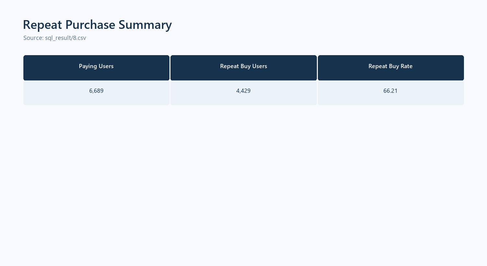

当前定义是“观察期内发生至少两次购买行为的用户”为复购用户。如果业务需要更加严格的口径，可以改为“至少在两个不同日期购买”或“至少完成两个不同订单”。

### 5.7 RF 用户分层
- 用户距离最近一次购买有多久？
- 用户购买频率如何？
- 如何利用 R（Recency）和 F（Frequency）划分高价值、潜力、沉睡和一般用户？

由于数据没有订单金额，本项目使用最近购买间隔 R 和购买频率 F：

```sql
WITH user_buy AS (
    SELECT
        user_id,
        MAX(behavior_date) AS last_buy_date,
        COUNT(*) AS frequency
    FROM user_behavior
    WHERE behavior_type = 'buy'
    GROUP BY user_id
),
user_rf AS (
    SELECT
        user_id,
        last_buy_date,
        frequency,
        MAX(last_buy_date) OVER () - last_buy_date AS recency_days
    FROM user_buy
),
rf_median AS (
    SELECT
        PERCENTILE_CONT(0.5) WITHIN GROUP (
            ORDER BY recency_days
        ) AS recency_median,
        PERCENTILE_CONT(0.5) WITHIN GROUP (
            ORDER BY frequency
        ) AS frequency_median
    FROM user_rf
),
rf_score AS (
    SELECT
        ur.user_id,
        ur.last_buy_date,
        ur.recency_days,
        ur.frequency,
        CASE
            WHEN ur.recency_days <= rm.recency_median THEN 2
            ELSE 1
        END AS r_score,
        CASE
            WHEN ur.frequency >= rm.frequency_median THEN 2
            ELSE 1
        END AS f_score
    FROM user_rf AS ur
    CROSS JOIN rf_median AS rm
)
SELECT
    r_score,
    f_score,
    COUNT(*) AS user_count
FROM rf_score
GROUP BY r_score, f_score
ORDER BY r_score DESC, f_score DESC;
```

再利用中位数对 R、F 打分：

| R 得分 | F 得分 | 用户类型 | 运营策略 |
|---:|---:|---|---|
| 2 | 2 | 高价值用户 | 会员权益、提前购、重点维护 |
| 2 | 1 | 潜力用户 | 关联推荐、加购激励 |
| 1 | 2 | 重要召回用户 | 定向优惠、流失预警 |
| 1 | 1 | 一般/沉睡用户 | 低成本触达、控制营销成本 |

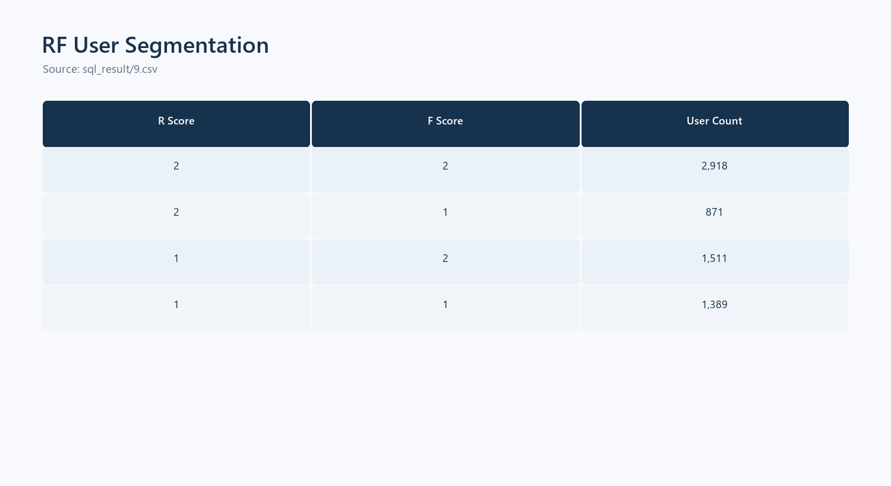

### 5.8 商品与类目分析

统计行为量不少于 100 次的商品类目，并按购买次数筛选 Top 20：

```sql
SELECT
    category_id,
    COUNT(*) AS event_count,
    COUNT(*) FILTER (
        WHERE behavior_type = 'pv'
    ) AS pv_count,
    COUNT(*) FILTER (
        WHERE behavior_type = 'cart'
    ) AS cart_count,
    COUNT(*) FILTER (
        WHERE behavior_type = 'fav'
    ) AS fav_count,
    COUNT(*) FILTER (
        WHERE behavior_type = 'buy'
    ) AS buy_count,
    ROUND(
        COUNT(*) FILTER (
            WHERE behavior_type = 'buy'
        ) * 100.0
        / NULLIF(
            COUNT(*) FILTER (
                WHERE behavior_type = 'pv'
            ),
            0
        ),
        2
    ) AS buy_pv_rate
FROM user_behavior
GROUP BY category_id
HAVING COUNT(*) >= 100
ORDER BY buy_count DESC
LIMIT 20;
```

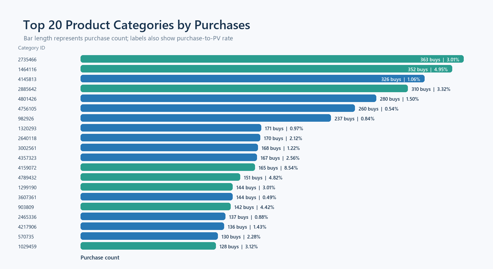

图中按购买次数从高到低排列商品类目，并同时标注购买次数和购买/PV 比率。购买次数反映类目的成交规模，`buy_pv_rate` 则用于比较不同流量规模下的购买效率。高购买量但低购买率的类目适合优先优化商品详情、价格和促销策略；购买率较高但流量较小的类目可以考虑增加曝光。


## 6. 机器学习建模

购买预测代码位于 [`purchase_prediction_ml.py`](purchase_prediction_ml.py)，调参代码位于 [`GridsearchCV.py`](GridsearchCV.py)。

### 6.1 预测目标与样本粒度

预测粒度为：

```text
user_id + item_id
```

特征窗口：

```text
2017-11-25 00:00:00
至
2017-12-03 00:00:00（不包含）
```

标签窗口：

```text
2017-12-03 当天
```

标签定义：

```python
feature_df = df[
    (df["datetime"] >= "2017-11-25")
    & (df["datetime"] < "2017-12-03")
]

label_df = df[
    (df["date"].astype(str) == "2017-12-03")
    & (df["behavior_type"] == "buy")
][["user_id", "item_id"]].drop_duplicates()

label_df["label"] = 1
dataset = features.merge(
    label_df,
    on=["user_id", "item_id"],
    how="left",
)
dataset["label"] = (
    dataset["label"]
    .fillna(0)
    .astype(int)
)
```

- `label = 1`：用户在标签日购买了该商品。
- `label = 0`：用户在特征窗口与该商品有交互，但标签日没有购买。

特征和标签按时间隔离，避免把标签日行为泄漏到模型输入中。

### 6.2 基础行为次数

```python
features = feature_df.pivot_table(
    index=["user_id", "item_id"],
    columns="behavior_type",
    values="timestamp",
    aggfunc="count",
    fill_value=0,
).reset_index()
```

得到用户对商品的历史浏览、收藏、加购和购买次数。

### 6.3 多时间窗口特征

分别统计标签日前 1、3、7 天的四类行为：

```python
behavior_types = ["pv", "fav", "cart", "buy"]

for window_days in [1, 3, 7]:
    window_start = (
        label_time
        - pd.Timedelta(days=window_days)
    )
    window_df = feature_df[
        (feature_df["datetime"] >= window_start)
        & (feature_df["datetime"] < label_time)
    ]

    window_features = window_df.pivot_table(
        index=["user_id", "item_id"],
        columns="behavior_type",
        values="timestamp",
        aggfunc="count",
        fill_value=0,
    ).reindex(
        columns=behavior_types,
        fill_value=0,
    )

    window_features.columns = [
        f"{behavior}_count_{window_days}d"
        for behavior in window_features.columns
    ]
```

最终包括：

```text
pv_count_1d    fav_count_1d    cart_count_1d    buy_count_1d
pv_count_3d    fav_count_3d    cart_count_3d    buy_count_3d
pv_count_7d    fav_count_7d    cart_count_7d    buy_count_7d
```

多窗口特征可以帮助模型区分长期兴趣和近期购买意图。

### 6.4 最后一次行为序列特征

```python
last_behavior = (
    feature_df
    .sort_values(
        ["user_id", "item_id", "datetime"]
    )
    .groupby(
        ["user_id", "item_id"],
        as_index=False,
    )
    .tail(1)
)

last_behavior["hours_since_last_behavior"] = (
    label_time - last_behavior["datetime"]
).dt.total_seconds() / 3600

behavior_code = {
    "pv": 1,
    "fav": 2,
    "cart": 3,
    "buy": 4,
}

last_behavior["last_behavior_type"] = (
    last_behavior["behavior_type"]
    .map(behavior_code)
    .astype("int8")
)
```

其中：

- `hours_since_last_behavior`：最后一次行为距离标签日的小时数。
- `last_behavior_type`：最后一次行为类型。

### 6.5 模型选择

本项目使用随机森林作为基线模型：

```python
from sklearn.ensemble import RandomForestClassifier

model = RandomForestClassifier(
    n_estimators=100,
    max_depth=8,
    random_state=42,
    class_weight="balanced",
)

model.fit(X_train, y_train)
```

选择随机森林的原因：

- 能处理非线性关系和特征交互；
- 对特征缩放不敏感；
- 能处理行为次数、时间间隔等混合数值特征；
- 可通过特征重要性解释模型；
- `class_weight="balanced"` 能缓解购买样本稀少的问题。

### 6.6 数据切分

```python
from sklearn.model_selection import train_test_split

X_train, X_test, y_train, y_test = (
    train_test_split(
        X,
        y,
        test_size=0.2,
        random_state=42,
        stratify=y,
    )
)
```

`stratify=y` 保证训练集和测试集维持相近的正负样本比例。更严格的生产评估应使用滚动时间窗口，而不是仅使用随机切分。

### 6.7 参数搜索

```python
from sklearn.model_selection import (
    GridSearchCV,
    StratifiedKFold,
)

param_grid = {
    "n_estimators": [200, 500, 800],
    "max_depth": [6, 10, 15],
    "min_samples_leaf": [1, 5, 10],
    "max_features": ["sqrt", "log2", 0.5],
    "class_weight": [
        "balanced",
        "balanced_subsample",
    ],
}

cv = StratifiedKFold(
    n_splits=5,
    shuffle=True,
    random_state=42,
)

gs = GridSearchCV(
    estimator=rf,
    param_grid=param_grid,
    scoring="average_precision",
    cv=cv,
    n_jobs=-1,
    verbose=2,
)

gs.fit(X_train, y_train)
```

购买预测属于类别高度不平衡任务，因此不使用 Accuracy 作为主要调参指标。一个全部预测为“不购买”的模型可能拥有很高的准确率，但没有业务价值。

### 6.8 评估指标

```python
from sklearn.metrics import (
    classification_report,
    roc_auc_score,
)

y_pred = model.predict(X_test)
y_proba = model.predict_proba(X_test)[:, 1]

print(classification_report(y_test, y_pred))
print("AUC:", roc_auc_score(y_test, y_proba))
```

实际运行结果：

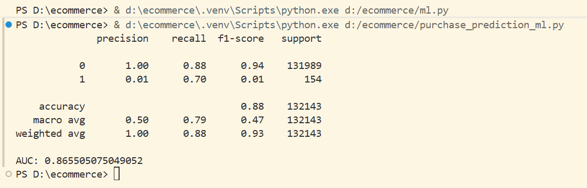

测试集中共有 132,143 个用户—商品样本，其中正样本（次日发生购买）只有 154 个，占比约为 **0.12%**，负样本与正样本数量之比约为 **857:1**。因此不能只根据 Accuracy 或 weighted avg 判断模型质量。

结果分析：

- **ROC-AUC 为 0.8655**：模型对购买样本和未购买样本具有较好的整体排序能力，说明多时间窗口行为次数、最近一次行为类型和行为间隔等特征包含有效购买信号。
- **正样本 Recall 为 0.70**：约 70% 的真实购买样本被模型识别出来，适合强调覆盖率的潜客召回场景。
- **正样本 Precision 仅为 0.01，F1-score 为 0.01**：模型为了召回购买用户产生了大量误报。如果直接对全部预测正例发放优惠券，会带来较高营销成本。
- **Accuracy 为 0.88，不适合作为主要指标**：在当前测试集中，即使全部预测为“不购买”，准确率也约为 99.88%。因此 88% 的准确率不能证明模型具有良好的购买识别效果。
- **weighted avg 被负样本主导**：加权 Precision 和 F1-score 看起来很高，但不能代表少数类购买样本的预测质量，应重点查看类别 1 的 Precision、Recall、F1-score，以及 PR-AUC。

后续应在验证集上调整分类阈值，并结合业务预算使用 PR-AUC、Precision-Recall 曲线、Recall@Top-K、Precision@Top-K 和 Lift 选择实际触达用户。例如营销资源有限时，可按购买概率从高到低选择 Top 1% 或 Top 5% 用户，而不是固定使用 `0.5` 阈值。

重点指标：

| 指标 | 分析价值 |
|---|---|
| Precision | 被模型判为会购买的样本中，有多少真实购买 |
| Recall | 所有真实购买样本中，模型识别出了多少 |
| F1-score | Precision 与 Recall 的综合表现 |
| ROC-AUC | 模型对正负样本的整体排序能力；本次结果为 0.8655 |
| PR-AUC | 极度不平衡场景下更重要的正样本识别能力，建议在后续评估中补充 |
| Precision@Top-K | 在有限营销名单中，排名靠前用户的真实购买比例 |
| Recall@Top-K | Top-K 名单覆盖了多少真实购买用户 |
| Lift | 模型筛选相对于随机触达带来的购买率提升 |

## 7. 结论与业务建议

以下结论基于当前 SQL 分析结果和项目数据子集：

1. **越接近交易的行为，购买转化信号越强。** 浏览、收藏、加购后的有效购买转化率约为 2.50%、4.49% 和 6.61%。建议重点关注加购用户，并对加购未购买用户优先使用库存提醒、限时优惠和购物车召回等措施，而对收藏用户使用降价提醒。

2. **流量在观察期后段明显增强。** 12 月 2 日行为量达到窗口峰值，12 月 3 日仍处于高位。建议将活动资源、客服排班、广告预算和库存准备向高流量日期倾斜，同时比较活动前后的购买转化率，而不仅是流量增幅。

3. **小时流量集中在中午至下午早段。** 当前数据中 12—14 时较活跃，13 时达到小时行为峰值。消息推送和促销触达可在峰值前进行预热，但需要通过 A/B 测试验证增量效果，避免高峰期自然流量造成因果误判。

4. **观察期内复购用户占比较高。** 当前复购率约为 66.21%，说明购买用户中存在较强的重复购买行为。建议进一步区分“同日多次购买”“跨日复购”和“跨类目复购”，并针对高频用户建立会员或忠诚度运营策略。

5. **高流量商品不一定具有高购买效率。** 商品运营不应只按 PV 排名，应同时观察 UV、加购率、购买率以及商品的日/小时流量。对高浏览低购买商品，应优先检查价格、详情页、评价、库存和履约因素；对高加购商品，应加强临门转化策略。

## 8. 项目结构与运行方式

```text
ecommerce/
├── data/
│   ├── row/
│   │   └── UserBehavior.csv
│   └── processed/
│       ├── user_behavior_cleaned.csv
│       └── user_behavior_cleaned_sample.csv
├── docs/
│   └── images/
│       └── sql/
│           ├── 01_sql_result.png
│           ├── 03_daily_traffic.png
│           └── ...
├── sql_result/
│   ├── 1.csv ... 10.csv
│   └── generate_readme_images.py
├── 1_creat_table.sql
├── 2_overview_metrics.sql
├── data_cleaning.py
├── purchase_prediction_ml.py
├── GridsearchCV.py
└── README.md
```

### 8.1 创建虚拟环境

```powershell
python -m venv .venv
.\.venv\Scripts\Activate.ps1
pip install pandas scikit-learn
```

### 8.2 执行数据清洗

```powershell
python data_cleaning.py
```

### 8.3 导入 PostgreSQL 并执行分析

依次执行：

```text
1_creat_table.sql
2_overview_metrics.sql
```

### 8.4 训练购买预测模型

```powershell
python purchase_prediction_ml.py
```

运行网格搜索：

```powershell
python GridsearchCV.py
```

## 后续优化方向

- 使用滚动时间窗口构造多个训练日、验证日和测试日；
- 增加次日、3 日和 7 日留存分析；
- 加入行为转换序列、活跃天数、行为间隔和趋势比例特征；
- 使用 LightGBM/XGBoost 与随机森林进行对比；
- 使用时间切分和阈值优化提升离线评估可靠性；
- 增加模型特征重要性、SHAP 解释和用户购买概率分层。

